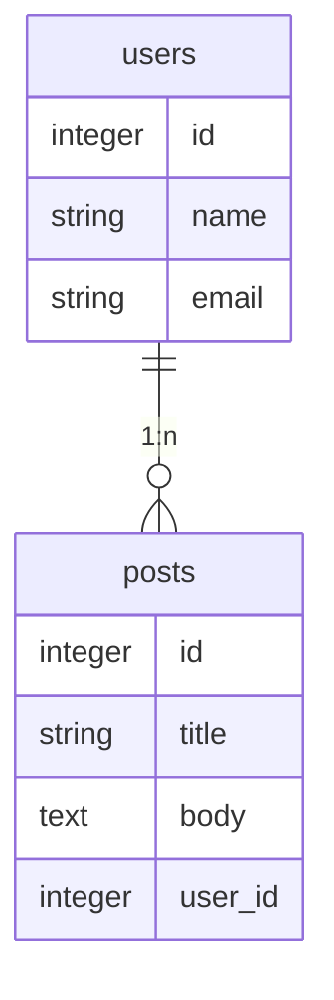

# Laravel10 インストール
まず、始めに Laravel 10 をインストール環境について
動作環境の構築については、説明は省略しております。

Laravel 10 で動作する PHP のバージョンは 8.1 以上で
動作しますのでご注意下さい。

## インストールについて
Laravel のインストールについては、プロジェクトを作成時に
関連ファイルが配置されますので、プログラム毎に違うバージョンを
使用する事が出来ますので、プロジェクトの作成時にバージョンを指定しない場合は
最新のバージョンで Laravel 実行ファイルが用意されます。

## プロジェクトの作成
`comoser` の `create-project` コマンドを利用して laravel のアプリプロジェクトを作成します。

```bash
composer create-project laravel/laravel laravel10-project-1
```
プロジェクトの作成が完了したら **laravel10-project-1** フォルダに移動します。
`php artisan -V` コマンドを実行するとインストールした Laravelのバージョンを確認することができます。
```bash
cd laravel10-project-1
php artisan -V
```
```bash
Laravel Framework 10.9.0
```
### 設定とメッセージの日本語化
- `timezone` タイムゾーン
- `locale` 表示に使用する言語
- `faker_locale` テスト用ダミーデータ言語

```bash
vim config/app.php
```
```php
'timezone' => 'Asia/Tokyo',
'locale' => 'ja',
'faker_locale' => 'ja_JP',
```
翻訳ファイルの配置
以下のコマンドを実行すると、翻訳用ファイルが配置されます。
`lang/en/*.php`
```bash
php artisan lang:publish
```
日本語ファイル配置
以下のコマンドを実行すると、翻訳用ファイルが配置されます。
`lang/ja/*.php` `lang/ja.json`
```bash
composer require askdkc/breezejp --dev
php artisan breezejp
```
### 開発環境と本番環境を切替
開発環境と本番環境で変わる可能性がある情報を**環境変数**に保存します。
環境変数は、プロジェクトフォルダ内の `.env` ファイルで一括管理されます。

例えば、開発環境では環境変数 APP_ENV に dev を設定して
本番環境では環境変数 APP_ENV に production と設定して
プログラムにて 環境変数を参照して動作を変える事ができます。
使用例として、`config/app.php` 内に以下の様に記述しています。
```php
'env' => env('APP_ENV', 'production');
```
これは .env ファイルの APP_ENV に値が無い場合は production として設定している処理になります。

### 開発サーバーの起動
`php artisan serve` コマンドを実行すると開発サーバが起動します。
```bash
php artisan serve
```
```bash

   INFO  Server running on [http://127.0.0.1:8000].  

  Press Ctrl+C to stop the server

```
ブラウザから http://127.0.0.1:8000 にアクセスすると初期画面が表示されます。

## データーベースの作成
動作確認を行うために簡易的なデータベースである **SQLite** データベースを利用します。

### データーベース設定
プロジェクトフォルダ直下にある`.env`ファイルを開きます。
`.env`ファイルは環境変数を保存するファイルでそれぞれの環境に応じた値を設定します。
データベースのパスワード情報など外部に漏れてはいけない情報も保存します。

Laravel ではデフォルトのデータベースは**MySQL**となっていますのでMySQLの設定を**SQLite**の設定に変更します。
```bash
vim .env
```
```bash
DB_CONNECTION=sqlite
#DB_HOST=127.0.0.1
#DB_PORT=3306
#DB_DATABASE=laravel
#DB_USERNAME=root
#DB_PASSWORD=
```
先頭に DB_* がついた環境変数が設定されていますが DB_CONNECTION 以外の行を#コメントにします。

### データベーステーブル作成
設定が完了したので `php artisan migrate` コマンドを実行します。
`php artisan migrate` コマンドを実行すると database/migrations フォルダに保存されている
マイグレーションファイルを元にデータベースにテーブルを作成してくれます。
```bash
php artisan migrate
```
```bash

   WARN  The SQLite database does not exist: database/database.sqlite.  

  Would you like to create it? (yes/no) [no]
❯ yes
```
`php artisan migrate` コマンドを実行するとSQLiteのデータベースファイルが存在しないため作成するか聞かれるので **yes** を選択するとdatabaseフォルダにdatabase.sqliteファイルが作成されます。
```bash

   INFO  Preparing database.  

  Creating migration table ........................................... 33ms DONE

   INFO  Running migrations.  

  2014_10_12_000000_create_users_table ............................... 6ms DONE
  2014_10_12_100000_create_password_reset_tokens_table ............... 2ms DONE
  2019_08_19_000000_create_failed_jobs_table ......................... 5ms DONE
  2019_12_14_000001_create_personal_access_tokens_table .............. 6ms DONE

```
SQLiteはファイルベースのデータベースなのでdatabase.sqliteファイルにデータベースデータが保存されます。
デフォルトでは4つのテーブルが作成されます。

## Laravel Breezeのインストール
Laravel Breeze は Laravelが提供する**認証機能**です。

ユーザの登録やログイン機能を簡単に利用することができます。
Laravel Breezeを利用するためにPHPのパッケージのインストールが必要となります。

```bash
composer require laravel/breeze --dev
```

Laravel Breezeを利用するために **nodejs** のパッケージ管理ツール **npm** が必要となります。
```bash
dnf install nodejs
```
nodejs バージョン確認
```bash
node -v
```
```bash
v16.18.1
```
npm バージョン確認
```bash
npm -v
```
```bash
8.19.2
```

Laravel Breeze で認証画面を作成する場合、どの技術を利用して画面を作成するか決める必要があります。
デフォルトでは templateエンジンの **Blade** が利用されます。
そのほかにUIフレームワーク/ライブラリの Vue/React を利用することもできますが
その際には Inertia が一緒にインストールされます。
Vue/React だけではなくInertia の理解が必要になります。
Livewireも選択でき、こちらはPHPの技術で動的なページを作成することができます。

ここではデフォルトの **Blade** を利用して認証画面を作成します。

```bash
php artisan breeze:install blade
```
```bash
vite v4.3.3 building for production...
✓ 47 modules transformed.
public/build/manifest.json             0.26 kB │ gzip:  0.13 kB
public/build/assets/app-fad19fcd.css  29.86 kB │ gzip:  5.79 kB
public/build/assets/app-20106add.js   69.81 kB │ gzip: 26.01 kB
✓ built in 7.28s

   INFO  Breeze scaffolding installed successfully.  
```
Blade は JavaScript を利用しませんがコマンドを実行すると
JavaScript のライブラリのインストールと
JavaScript のビルドツールの **Vite** が実行されていることがわかります。

package.json ファイルにインストールした JavaScript ライブラリの情報が記述されます。
JavaScript フレームワークの **alpine.js** や **Tailwind CSS** がインストールされていることがわかります。

Breeze のインストールが完了したら `php artisan serve` コマンドを実行してブラウザからアクセスしてください。
右上に Login と Register のリンクが追加表示されていることが確認できます。

## ユーザー一覧表示
ログインしたユーザのみアプリケーションに登録したユーザ一覧が表示されるように設定を行ってきます。

### コントローラーの作成
既存の User モデルを利用するため 新たにモデルの追加を行わないため User モデルを利用してコントローラーの作成を行います。
`make:controller` のオプションに `-m` をつけて実行すると指定した User を元に
コントローラーファイルを作成してくれます。
```bash
php artisan make:controller UsersController -m User
```

`app/Http/Controller` の下に `UsersController.php` ファイルが作成されます。
各関数の横に戻り値の型が設定されていることが確認できます。
Laravel10 からの新機能です。

表示されている戻り値の型には *Response* と *RedirectResponse* があります。

```bash
vim app/Http/Controller/UsersController.php
```
@import "app/Http/Controllers/UsersController.php" {code_block=true}

ヘルパー関数の *response* を利用して `index` 関数が実行されたら文字列の ”Hello World” が戻されるように設定を行います。
```php
    public function index(): Response
    {
        return response('Hello World');
    }
```

コントローラーの設定が完了したら `web.php` に `/users` のルーティングの追加を行います。
```bash
vim routes/web.php
```
```php
use App\Http\Controllers\ProfileController;
use App\Http\Controllers\UsersController;
use Illuminate\Support\Facades\Route;

Route::middleware('auth')->group(function () {
    Route::get('/users', [UsersController::class, 'index']);
});
```
ブラウザから追加した `/users` にアクセスするとコントローラーで設定した ”Hello World”がブラウザ上に表示されます。

### 戻り値の型の動作確認
`index` 関数の戻り値の型がどのように影響を与えるのか確認するために `UsersController.php` ファイルの戻り値をヘルパー関数の *response* から *view* に変更して引数には作成済みの *dashboard* の `view` ファイルを指定します。
```bash
vim app/Http/Controller/UsersController.php
```
```php
    public function index(): Response
    {
        return view('dashboard');
    }
```
再度アクセスするとエラー画面が表示されます。
`view` ファイルの場合は *Reponse* ではなく *View* の型の設定必要であることがわかります。
このように戻り値の型と戻される値が異なる場合にエラーが表示される仕組みになっています。

`View` をインポートして戻り値の型を *View* に変更します。
```bash
vim app/Http/Controller/UsersController.php
```
```php
<?php

namespace App\Http\Controllers;

use App\Models\User;
use Illuminate\Http\RedirectResponse;
use Illuminate\Http\Request;
use Illuminate\Http\Response;
use Illuminate\View\View;

class UsersController extends Controller
{
    /**
     * Display a listing of the resource.
     */
    public function index(): View
    {
        //return response('Hello World');
        return view('dashboard');
    }
	//略
}
```
ブラウザからアクセスするとダッシュボードが表示されます。

戻り値の型は必須ではないので設定しなくても問題なく動作します。

コントローラーの戻り値の型として *Response* の他に *RedirectRespons* eの型を設定した場合はヘルパー関数の `redirect` を利用することでエラーなしで処理が行われます。

### Viewファイルの作成
`resources/views` フォルダに `users` フォルダを作成してその下に `index.blade.php` ファイルを作成します。
中身は `dashboard.blade.php` ファイルを利用しています。

```bash
vim resources/views/users/index.blade.php
```
```php
<x-app-layout>
    <x-slot name="header">
        <h2 class="font-semibold text-xl text-gray-800 leading-tight">
            {{ __('Users') }}
        </h2>
    </x-slot>

    <div class="py-12">
        <div class="max-w-7xl mx-auto sm:px-6 lg:px-8">
            <div class="bg-white overflow-hidden shadow-sm sm:rounded-lg">
                <div class="p-6 text-gray-900">
                    <h1>ユーザ一覧</h1>
                </div>
            </div>
        </div>
    </div>
</x-app-layout>
```

`x-app-layout` タグは `resources/views/layouts/app.blade.php` のレイアウトを利用しています。

作成した `View` ファイルを `index` 関数の `view` 関数の引数に設定します。

```bash
vim app/Http/Controller/UsersController.php
```
```php
    public function index(): View
    {
        return view('users.index');
    }
```
`/users` にアクセスするとユーザ一覧の文字列を確認することができます。


ページ上部のナビゲーションにユーザ一覧ページへのリンクを貼るために `layouts` フォルダの `navigation.blade.php` ファイルにリンクを追加します。
`navigation.blade.php` ファイルの中から **Navigation Links** を探して追加を行ってください。
`route`、`routeIs` 関数の引数はルーティングの名前を設定するため下記のように設定します。
```bash
vim resources/views/layouts/navigation.blade.php
```
```php
                <!-- Navigation Links -->
                <div class="hidden space-x-8 sm:-my-px sm:ml-10 sm:flex">
                    <x-nav-link :href="route('dashboard')" :active="request()->routeIs('dashboard')">
                        {{ __('Dashboard') }}
                    </x-nav-link>
                    <x-nav-link :href="route('users.index')" :active="request()->routeIs('users.index')">
                        {{ __('Users') }}
                    </x-nav-link>
                </div>
```

ルーティングファイルで追加したルーティングの `/users` には `name` をつけていなかったので追加します。
```bash
vim routes/web.php
```
```php
Route::middleware('auth')->group(function () {
    Route::get('/users', [UsersController::class, 'index'])->name('users.index');
});
```
設定後に `/users` にアクセスすると上部のナビゲーションに Users が追加されていることが確認できます。


コントロラーファイルでは `User` モデルを利用してユーザ情報を取得するため `User:all()` を実行します。
取得したユーザ情報を `view` ファイルに `$users` 変数として渡しています。
```bash
vim app/Http/Controller/UsersController.php
```
```php
    public function index(): View
    {
        return view('users.index',['users' => User::all()]);
    }
```
`View` ファイルでは受け取った `$users` 変数を `foreach` ディレクティブを利用して展開して表示しています。


```bash
vim resources/views/users/index.blade.php
```
```php
                <div class="p-6 text-gray-900">
                    <h1>ユーザ一覧</h1>
                    <ul>
                    @foreach($users as $user)
                        <li>Name: {{ $user->name }} / {{ $user->email }}</li>
                    @endforeach
                    </ul>
                </div>
```
ブラウザから確認するとデータベースの `users` テーブルに保存されているユーザ情報が表示されます。

### Database Seeding の利用
データテーブルにダミーのデータを挿入したい場合に **database seeding** を利用することができます。

デフォルトで `database/seeders` フォルダに `DatabaseSeeder.php` ファイルが存在するのでそのファイルを利用します。
コメントされているのでコメントをはずします。
下記では10名分のダミーデータが `users` テーブルに追加さるれます。
```bash
vim database/seeders/DatabaseSeeder.php
```
@import "database/seeders/DatabaseSeeder.php" {code_block=true}

`php artisan db:seed` コマンドでSeedingを実行します。
```bash
php artisan db:seed
```

`/users` にアクセスすると新たにダミーの10名分のユーザが登録されていることが確認できます。

Laravel10 をインストール後はこのようにコントローラー、ルーティングを追加してアプリケーションを構築していきます。

## 投稿アプリ作成
フォームを作成して、入力データのバリデーションをして、データーベースに保存、変更、削除、一覧表示、までのアプリを作成していきます。
### テーブルの新規作成
テーブルを新規で作成するには、マイグレーションファイルにテーブルカラム情報などを記述して
コマンドで、マイグレーションファイルを元に、新規テーブルを作成して行きます。

マイグレーションファイルとモデルファイルのテンプレートをコマンドで作成
```bash
php artisan make:model Post -m
```
作成して、マイグレーションファイルは、`database/migrations/****_create_post_table.php` となります。

ファイルの中には、up メソッドと down メソッドが記述されています。

up メソッドには、マイグレート実行に行う事を記述します。
テーブル新規作成する場合には、テーブル内のカラム情報を設定していきます。

down メソッドには、処理を取り消す時に行う事を記述します。

マイグレーションファイルを作成した時は、以下の様になります。
```php
<?php

use Illuminate\Database\Migrations\Migration;
use Illuminate\Database\Schema\Blueprint;
use Illuminate\Support\Facades\Schema;

return new class extends Migration
{
    /**
     * Run the migrations.
     */
    public function up(): void
    {
        Schema::create('posts', function (Blueprint $table) {
            $table->id();
            $table->timestamps();
        });
    }

    /**
     * Reverse the migrations.
     */
    public function down(): void
    {
        Schema::dropIfExists('posts');
    }
};

```
up メソッド内には id カラムと timestamps カラムの設定が最初から記述してます。

timestamps カラムは created_at (作成日時) カラムと updated_at (編集日時) カラムを意味しています。

テーブルにカラムを追加したい情報を、id と timestamp の間に記述していきます。

カラムの設定方法
`$table->データ型('カラム名')->カラム修飾子`

まずは、カラムのデータ型について説明します。
| マイグレーションファイルで記述する<br>データの型 | データベースで使用する<br>データ型 | 備考                     |
| :----------------------------------------------- | :--------------------------------- | :----------------------- |
| integer                                          | INTEGER                            | 整数                     |
| string                                           | VARCHAR                            | 文字列(255文字程)        |
| text                                             | TEXT                               | 長文文字列(16,384文字程) |
| longText                                         | LONGTEXT                           | 大量の文字列(1GB程)      |
| unsignedBigInteger<br>foreignId                  | 符号なし BIGINT                    | 他のテーブルのID         |
| boolean                                          | BOOLEAN                            | true / false             |
| date                                             | DATE                               | 日付                     |
| dateTime                                         | DATETIME                           | 日時                     |

次に、カラム修飾子について説明します。
| 修飾子            | 使用時                                                    |
| :---------------- | :-------------------------------------------------------- |
| nullable()        | NULL 値を許容<br>入力されない可能性があるカラムに設定する |
| after('カラム名') | 指定したカラムの後に設置する                              |
| default('値')     | デフォルトで入れる値を設定する                            |
| unique()          | カラムに重複した値を入れない様にする                      |

早速、title カラムと body カラムを記述して行きます。
```php
<?php

use Illuminate\Database\Migrations\Migration;
use Illuminate\Database\Schema\Blueprint;
use Illuminate\Support\Facades\Schema;

return new class extends Migration
{
    /**
     * Run the migrations.
     */
    public function up(): void
    {
        Schema::create('posts', function (Blueprint $table) {
            $table->id();
            $table->string('title');
            $table->text('body');
            $table->timestamps();
        });
    }

    /**
     * Reverse the migrations.
     */
    public function down(): void
    {
        Schema::dropIfExists('posts');
    }
};
```
マイグレートを実行して、posts テーブルを作成します。
```bash
php artisan migrate
```

### モデル
前項でマイグレーションファイルとモデルファイルを `php artisan make:model Post -m` コマンドを使用して
モデルファイルを作成してますので、マイグレーションファイルに記述した、`title` `body` カラム情報を、モデルファイルにも記述していきます。
```bash
vim app/Models/Post.php
```
```php
<?php

namespace App\Models;

use Illuminate\Database\Eloquent\Factories\HasFactory;
use Illuminate\Database\Eloquent\Model;

class Post extends Model
{
    use HasFactory;

    protected $fillable = [
        'title',
        'body',
    ];
}
```
`fillable` プロパティにカラム名を記述してます。
一括で値を保存・更新したいカラムを設定します。

fillable プロパティを使う理由は、セキュリティの為です。
fillable で設定した値以外は、一括保存・更新処理から除外する様になってます。

ただ fillable プロパティを使うと、カラム名を1つずつ設定するので、カラム名が多い場合は、
`guarded` プロパティを使うといいでしょう。
guarded プロパティは、一括保存・更新しないカラムを指定します。

fillable はホワイトリスト、guardedはブラックリスト用に使うと覚えておくといいでしょう。

### 表示用ビューファイル作成
`resources/views/post` に投稿用の post フォルダを作成します。
`resources/views/post/create.blade.php` 投稿フォームのビューファイルを作成します。
```bash
mkdir resources/views/post
vim resources/views/post/create.blade.php
```
```php
<x-app-layout>
    <x-slot name="header">
        <h2 class="font-semibold text-xl text-gray-800 leading-tight">
            投稿フォーム
        </h2>
    </x-slot>

    <div class="py-12">
    <div class="max-w-7xl mx-auto sm:px-6 lg:px-8">
        <form>
            <div class="w-full flex flex-col">
                <label for="title" class="font-semibold mt-4">件名</label>
                <input type="text" name="title" class="w-auto py-2 border border-gray-300 rounded-md" id="title">
            </div>
            <div class="w-full flex flex-col">
                <label for="title" class="font-semibold mt-4">本文</label>
                <textarea name="body" id="body" cols="30" rows="50" class="w-auto py-2 border border-gray-300 rounded-md"></textarea>
            </div>
            <x-primary-button class="mt-4">送信する</x-primary-button>
        </form>
    </div>
    </div>
    
</x-app-layout>
```
### コントローラー作成
投稿アプリを制御するコントローラーを作成します。
```bash
php artisan make:controller PostController -m Post
```
ビューファイルのコードを記述
```bash
vim app/Http/Controllers/PostController.php
```
`use Illuminate\View\View` 行と create メソッドの return に `view('post.create')` 記述しておく。
```php
use Illuminate\View\View;

public function create()
{
    return view('post.create');
}
```
フォームページの設定をルートに記述する
```bash
vim routes/web.php
```
```php
Route::middleware('auth')->group(function () {
    Route::get('/post/create', [PostController::class, 'create']);
});
```
ここまで、記述したら `http://127.0.0.1:8000/post/create` にアクセスしてフォームが表示されるか確認する

### 入力データ処理
まずは、フォーム入力した情報の保存ルート設定を追記します。
```bash
vim routes/web.php
```
```php
Route::middleware('auth')->group(function () {
    Route::get('/post/create', [PostController::class, 'create']);
    Route::post('/post/create', [PostController::class, 'store'])->name('post.store');
});
```
先程のフォーム入力ページのルート設定と違い `->name('post.store');` を追記してルート設定に名前を付けてます。
ルート設定名を付けることにより、次の作業、ビュー画面からルート設定名にてURLを参照出来る様になります。
```bash
vim resources/views/post/create.blade.php
```
`<form>` 部分を以下の様に変更します。
`@csrf` 部分はLaravel でフォーム画面には必ず必要な処理になりますので追記しておきます。
```php
        <form method="post" action="{{route('post.store')}}">
            @csrf
            ....省略....
        </form>
```
入力情報の検証処理
フォームからのリクエストを処理するクラスを作成して、入力情報の検証をしていきます。
```bash
php artisan make:request PostRequest
```
```bash
vim app/Http/Requests/PostRequest.php
```
```php
<?php

namespace App\Http\Requests;

use Illuminate\Foundation\Http\FormRequest;

class PostRequest extends FormRequest
{
    /**
     * Determine if the user is authorized to make this request.
     */
    public function authorize(): bool
    {
        return true;
    }

    /**
     * Get the validation rules that apply to the request.
     *
     * @return array<string, \Illuminate\Contracts\Validation\ValidationRule|array|string>
     */
    public function rules(): array
    {
        return [
            'title' => 'required|max:20',
            'body' => 'required|max:400'
        ];
    }
    public function messages()
    {
        return [
            'title.required' => '件名は必ず入力してください',
            'title.max' => '件名は最大20文字以内で入力してください',
            'body.required' => '本文は必ず入力してください',
            'body.max' => '本文は最大400文字以内で入力してください'
        ];
    }
}

```
ビューに入力情報を渡す
```bash
vim resources/views/post/create.blade.php
```
`@error('')` @error ディレクティブ バリデーションエラーメッセージが存在するかを判断します。
`old('')` フォーム入力値を保持しています。
```php
<x-app-layout>
    <x-slot name="header">
        <h2 class="font-semibold text-xl text-gray-800 leading-tight">
            投稿フォーム
        </h2>
    </x-slot>

    <div class="py-12">
    <div class="max-w-7xl mx-auto sm:px-6 lg:px-8">
        <form method="post" action="{{route('post.store')}}">
            @csrf
            <div class="w-full flex flex-col">
                <label for="title" class="font-semibold mt-4">件名</label>
                @error('title')
                <li class="mt-2">{{ $message }}</li>
                @enderror
                <input type="text" name="title" class="w-auto py-2 border border-gray-300 rounded-md" id="title" value="{{old('title')}}">
            </div>
            <div class="w-full flex flex-col">
                <label for="body" class="font-semibold mt-4">本文</label>
                @error('body')
                <li class="mt-2">{{ $message }}</li>
                @enderror
                <textarea name="body" id="body" cols="30" rows="50" class="w-auto py-2 border border-gray-300 rounded-md">{{old('body')}}</textarea>
            </div>
            <x-primary-button class="mt-4">送信する</x-primary-button>
        </form>
    </div>
    </div>
    
</x-app-layout>
```
入力情報を検証して、保存して、リダイレクトをする
```bash
vim app/Http/Controller/PostController.php
```
`use App\Http\Requests\PostRequest;` 先頭行に追記
`store` メソッド引数を `PostRequest $request` としてフォームリクエストを受け取る
`Post::create($validated);` でバリデーションした情報を保存
`return redirect('/post')` 正常に処理が終わったらリダイレクトする
`->withInput();` 検証異常時は、元のページに戻って、入力情報を付与してリダイレクトする。
```php
use App\Http\Requests\PostRequest;

    public function store(PostRequest $request)
    {
        $validated = $request->validated();
        $post = Post::create($validated);
        return redirect('/post')
        ->withInput();
    }
```
### 一覧表示
一覧表示ページ情報のルート設定を追記します。
```bash
vim routes/web.php
```
```php
Route::middleware('auth')->group(function () {
    Route::get('/post', [PostController::class, 'index']);
    Route::get('/post/create', [PostController::class, 'create']);
    Route::post('/post/create', [PostController::class, 'store'])->name('post.store');
});
```
一覧表示ページのビューを作成します。
```bash
vim resources/views/post/index.blade.php
```
```php
<x-app-layout>
    <x-slot name="header">
        <h2 class="font-semibold text-xl text-gray-800 leading-tight">
            投稿一覧
        </h2>
    </x-slot>

    <div class="px-6 max-w-7xl mx-auto sm:px-6 lg:px-8">
    <x-primary-button class="mt-4" onclick="location.href='/post/create'">新規投稿</x-primary-button>
        @foreach($posts as $post)
        <div class="mt-4 p-8 bg-white w-full rounded-2xl">
            <h1 class="p-4 text-lg font-semibold">{{$post->title}}</h1>
            <hr class="w-full">
            <p class="mt-4 p-4">{{$post->body}}</p>
            <div class="p-4 text-sm font-semibold">{{$post->created_at}}</div>
        </div>
        @endforeach
    </div>
    
</x-app-layout>
```
一覧表示ページのコントローラーの設定を追記します。
```bash
vim app/Http/Controller/PostController.php
```
```php
    public function index()
    {
        return view('post.index', ['posts' => Post::all()]);
    }
```

### リレーション
リレーションとは、モデル同士の間にリレーションを設定することで、データベーステーブルを関連づけられる様になります。

今回は、投稿したユーザーの名前を表示させるには、Post モデルと User モデルにリレーションを設定します。


１対多リレーションでは、１側のモデルを親モデル、多側のモデルを子モデルと呼びます。
子モデルのテーブルには、親モデルの **id** 情報を格納したカラムを入れる様にします。
カラム名は、親モデル名に **_id** と言う接尾辞を付けます。

posts テーブルの中に、**user_id** カラムを追加します。
user_id カラムには post が紐づく user の id を入れていきます。

すでに作成済みの posts テーブルに user_id カラムを追加するには、新たにマイグレーションファイルを作成して、マイグレーションを実行してカラムを追加作業を実施します。

`php artisan make:migration ファイル名 --table=テーブル名`
```bash
php artisan make:migration add_user_id_column_to_posts_table --table=posts
vim database/migrations/****_add_user_id_column_to_posts_table.php
```
既存の posts テーブルにデータがある場合は、*Cannot add a NOT NULL* エラーが発生すると思うのでのその際は、`$table->foreignId('user_id')->default('1');`でとりあえず対応した
```php
<?php

use Illuminate\Database\Migrations\Migration;
use Illuminate\Database\Schema\Blueprint;
use Illuminate\Support\Facades\Schema;

return new class extends Migration
{
    /**
     * Run the migrations.
     */
    public function up(): void
    {
        Schema::table('posts', function (Blueprint $table) {
            $table->foreignId('user_id');
        });
    }

    /**
     * Reverse the migrations.
     */
    public function down(): void
    {
        Schema::table('posts', function (Blueprint $table) {
            $table->dropColumn('user_id');
        });
    }
};
```
マイグレーションを実行
```bash
php artisan migrate
```
投稿時に、ユーザーの id を入れる処理を追記していきます。
```bash
vim app/Http/Controller/PostController.php
```
```php
    public function store(PostRequest $request)
    {
        //$post = Post::create($request->safe()->only(['title','body']));
        $data = $request->safe()->only(['title','body']);
        $data['user_id'] = auth()->id();
        $post = Post::create($data);
        return redirect('/post')
        ->withInput();
    }
```
モデルの更新許可カラム`fillable` に `user_id` を追記しておきます。
```bash
vim app/Models/Post.php
```
```php
    protected $fillable = [
        'title',
        'body',
        'user_id'
    ];
```

モデルにリレーションの設定

親モデル `User` に子モデル `Post` を参照する処理を追記します。
```bash
vim app/Models/User.php
```
```php
    public function posts() {
        return $this->hasMany(Post::class);
    }
```

子モデル `Post` に親モデル `User` を参照する処理を追記します。
```bash
vim app/Models/Post.php
```
```php
    public function user() {
        return $this->belongsTo(User::class);
    }
```

リレーションを利用して、親モデル `User` 情報を参照してビューに表示する
```bash
vim resources/views/post/index.blade.php
```
以下の様に変更して、User の name を参照して表示、name カラムが null の際は ?? で　匿名 と表示している。
```php
<div class="p-4 text-sm font-semibold">{{$post->created_at}} / {{$post->user->name??'匿名'}}</div>
```

リレーション先のデータ取得をEager ロードで取得
`Post::all()` で投稿データを取得した後に、ビュー側で `$post->user->name` で記述してますが、例えば投稿データが100件ある場合、ユーザーデーターを毎回100回SQLの接続をしているので処理的に遅くなりがちです。

上記の問題を解決するには、投稿データを取得する際に、一緒にユーザーデータもまとめて取得します。
`Post::with('user')->get()` と記述する事で1回でデータを取得できます。

## テストデータ作成
開発中のテストデータを効率的に作る機能として、Seeder 機能があります。
データーベーステーブルにひとつずつダミーデータを登録する場合に使用します。

今回は、posts テーブルにダミーデータを登録する為に、シーダーファイルを作成していきます。
シーダーファイルはコマンド `php artisan make:seeder ファイル名` で作成出来ます。
```bash
php artisan make:seeder PostSeeder
```
シーダーファイルは、`database/seeders` ディレクトリーに作成させます。

作成した、シーダーファイルを変更してダミーデータを作成してみます。
```bash
vim database/seeders/PostSeeder.php
```
```php
public function run(): void
{
    \App\Models\Post::create([
        'title' => 'テスト',
        'body' => 'シーダーのテスト',
        'user_id' => 1,
    ]);
}
```
シーダー作成コマンドを実行
```bash
php artisan db:seed --class=PostSeeder
```

上記の手順でダミーデータを登録は出来るのですが、大量のダミーデータを作成する場合は
面倒なので、そういう時は、**Factory** を使用してダミーデータを登録します。

ファクトリファイルはコマンド `php artisan make:factory モデル名Factory` で作成出来ます。
```bash
php artisan make:factory PostFactory
```
ファクトリファイルは、`database/factories` ディレクトリーに作成させます。
```bash
vim database/factories/PostFactory.php
```
ダミーデータのデータ型は `fake()->` 後に指定します。
`text` と指定すると、文字列のダミーデータを作成します。
```php
    public function definition(): array
    {
        return [
            'title'=>fake()->text(20),
            'body'=>fake()->realText(200),
            'user_id'=>\App\Models\User::factory(),
        ];
    }
```

#### factory データ型
| データタイプ                      | 入れるデータ         | ダミーデータ例                                               |
| :-------------------------------- | :------------------- | :----------------------------------------------------------- |
| address                           | 住所                 | 5320011 大阪府大阪市淀川区西中島 3-21                        |
| name                              | 名前                 | 山田 太郎                                                    |
| email                             | メールアドレス       | yamada@example.com                                           |
| randomDigit                       | ランダムな数字       | 8                                                            |
| numberBetween($min=100,$max=1000) | 指定した範囲内の数値 | 234                                                          |
| text                              | テキスト             | Qui quisquam temporibus sunt fugit.                          |
| realText                          | 日本語対応テキスト   | 日本語では宮沢賢治薯「銀河鉄道の夜」より文章が生成されます。 |
ダミーデータは日本語を作成することも出来ます。
`config/app.php` ファイル内の `faker_locale` を `ja_JP` と設定すると日本語で使用出来ます。

factory を実行するには、`database/seeders/DatabaseSeeder.php` ファイルに以下の様に追記していきます。
```bash
vim database/seeders/DatabaseSeeder.php
```
`run` メソッドに記述してある元からある行はコメントしておきます。
`\App\Models\Post::factory(10)->create();` ダミーデータを10件作成するように記述しました。
```php
    public function run(): void
    {
        // \App\Models\User::factory(10)->create();

        // \App\Models\User::factory()->create([
        //     'name' => 'Test User',
        //     'email' => 'test@example.com',
        // ]);
        \App\Models\Post::factory(10)->create();
    }
```
シーダーコマンドを実行して、ファクトリを実行します。
```bash
php artisan db:seed
```
ファクトリーは大量にデータを作る時に役に立ちます。

### ページネーション
ページネーションとは、ページ内容分割機能の事になります。
Laravelでは手軽にページネーションを実装出来ます。

コントローラーのモデル呼び出しを以下の様に変更して、ページネーションを実装します。
```bash
vim app/Http/Controller/PostController.php
```
`index` メソッドの以下の様に変更してみてください。
`->paginate(1ページで読み込みレコード数)`
```php
    public function index()
    {
        return view('post.index', ['posts' => Post::with('user')->orderBy('created_at','desc')->paginate(2)]);
    }
```

ビューにページネーションボタン表示を実装
```bash
vim resources/views/post/index.blade.php
```
以下の行を追記すると、ページネーションボタンがレンダリングされます。
```php
<div class="mt-4">{{$posts->links()}}</div>
```

ページネーションボタンのカスタマイズしたい場合は、以下のコマンドを実行します。
```bash
php artisan vendor:publish --tag=laravel-pagination
```
コマンド実行により、vendor ディレクトリ内のページネーション用ビューファイルを 
`resources/views/vendor/pagination/tailwind.blade.php` にコピーして編集する事のよって、ページネーションボタンをカスタマイズ出来ます。

カスタマイズするにあたり、tailwindcss を使用しているので css のコンパイルする必要があります。
開発中は `npm run dev` を実行してリアルタイムコンパイルをして、
公開時は `npm run build` を実行して `public/build` に静的ファイルとしてコンパイルをします。
