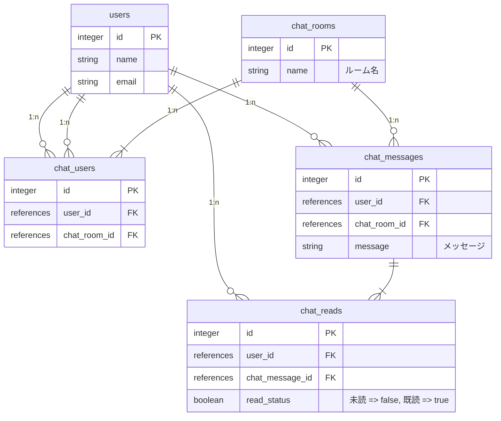

# Chat アプリ作成
PHP の Framework で Laravel を使用して Chat アプリを作成していきます。

## 命名規則
LaravelのコーディングスタイルはPHP-FIGが定めた規約のPSR-2に準拠している。
PSRにはPSR-0、PSR-1、PSR-2、PSR-4などがあり、PSR-0とPSR-4はPHPのオートローダーのための規約で、PSR-1とPSR-2は標準コーディング規約になっている。

| 記法             | 説明                                                           | 例        |
| :--------------- | :------------------------------------------------------------- | :-------- |
| スネークケース   | 単語の間を**アンダーバー**でつなぐ                             | user_item |
| アッパーキャメル | 単語の**先頭**をすべて**大文字**でつなぐ                       | UserItem  |
| ローワーキャメル | 先頭の単語だけ**小文字**、次からの単語先頭は**大文字**でつなぐ | userItem  |
| ケバブ           | 単語の間を**ハイフン**でつなぐ                                 | user-item |

| 種類                    | 記法             | 複数or単数 | 例                                                                |
| :---------------------- | :--------------- | :--------- | :---------------------------------------------------------------- |
| モデル名                | アッパーキャメル | 単数       | UserItem                                                          |
| テーブル名              | スネークケース   | 複数       | user_items                                                        |
| migrationのファイル名   | スネークケース   | 単数       | xxx_create_テーブル名_table<br>xxx_add_column_to_テーブル名_table |
| seedsのファイル名       | アッパーキャメル |            | UserItemsSeede                                                    |
| Controllersのファイル名 | アッパーキャメル |            | UserItemController                                                |
| viewsのファイル名       | スネークケース   |            | user_item                                                         |
| クラス名                | アッパーキャメル |            | UserItem                                                          |
| メソッド名              | ローワーキャメル |            | userItem                                                          |
| 変数名                  | スネークケース   |            | $user_item                                                        |
| ディレクトリ名          | アッパーキャメル |            | UserItem                                                          |
| ファイル名              | スネークケース   |            | user_item                                                         |

## Router
WEB
- 初期画面、ルーム選択画面
/chat/
ChatController::index
- 新規ルーム、メンバー選択画面
/chat/create
ChatController::create
- 既存ルーム、メンバー選択画面
/chat/xxx/edit
ChatController::edit
- ルーム詳細、メッセージ投稿画面
/chat/xxx
ChatController::show

API
- 新規ルーム、メンバー登録
/api/chat_room
Post
Api/ChatRoomController::store
- 既存ルーム、メンバー登録
/api/chat_room/xxx
Put
Api/ChatRoomController::update
- ルーム削除
/api/chat_room/xxx
Delete
Api/ChatRoomController::destroy
- メッセージ登録
/api/chat_message
Post
Api/ChatMessageController::store
Api/ChatMessageStore

Laravel-APIdoc-Generator を使用して、
API Controller コメント Document に仕様を記述して、仕様書を自動生成する

aglio
API Blueprint -> HTML Document

Drakov
API MockUpServer

Sanctum
SPA(Session)認証

## ERD図
| モデル名    | テーブル名    | 説明         |
| :---------- | :------------ | :----------- |
| User        | users         | ユーザー     |
| ChatRoom    | chat_rooms    | 部屋         |
| ChatUser    | chat_users    | 部屋ユーザー |
| ChatMessage | chat_messages | メッセージ   |
| ChatRead    | chat_reads    | 未読管理     |




**Pusher** から送られてくるデータを `Channel` で テーブル **ChatRoom** の `id` を `ChatRoom.{id}` と言う形で設定して行きます。

## Livewire
LivewireとはPHPのみでVueやReactのようなリアクティブな動的コンポーネントを作成できるライブラリです。

Livewireのコンポーネント内ではBladeの構文を使用することができるので、VueやReactよりもLaravelとの相性が良くなっています。

もともとはVueやReactの複雑さを解消するために開発されたもので、VueやReactよりもシンプルに扱うことができ、Laravel向けのライブラリなので、Laravelの快適さを損なうことなく開発できます。

VueやReactのようなフロントエンドのフレームワークと違ってLivewireはバックエンドで様々な処理を実行します。

つまり、コンポーネントで何か処理が発生するたびにAjaxを使用してサーバと通信を行い、サーバからのレスポンスを画面に反映しています。

その分サーバにかかる負荷は大きくなるので、この辺りもLivewireかInteriaを選択する際の判断材料になりそうです。
### Livewire インストール
Laravel LivewireでCRUDを実装してみる
https://kobatech-blog.com/livewire/

```bash
composer require livewire/livewire
```
Livewire のアセットを読み込む設定
`resources/views/layouts/app.blade.php` に以下を記述します。
- head タグ内に `@livewireStyles` を追記
- body 終了タグ直前に `@livewireScripts` を追記
```bash
vim resources/views/layouts/app.blade.php
```
```php
<!DOCTYPE html>
<html lang="ja">
<head>
    ....
    @livewireStyles
</head>
<body>
    ....
    @livewireScripts
</body>
</html>
```

## 制作物
### 準備
```bash
npm install dayjs --save-dev
```
```bash
vim resources/js/bootstrap.js
```
```javascript
/**
 * JavaScript Date Format library
 */
 import dayjs from 'dayjs';
 import ja from 'dayjs/locale/ja';
 window.dayjs = dayjs;
 dayjs.locale(ja);
```

### モデル、マイグレーション
クラスの複数形の「スネークケース」をテーブル名として使用します。
したがって、この場合、*Eloquent* は `Flight` モデルが `flights` テーブルにレコードを格納し、
`UserAuth` モデルは `user_auths` テーブルにレコードを格納すると想定できます。

`php artisan make:model モデル名 --migration --factory --seed` コマンドを実行してファイルを生成する

#### ChatRoom
```bash
php artisan make:model ChatRoom --migration --factory
```
```bash
vim database/migrations/****_create_chat_rooms_table.php
```
```php
<?php

use Illuminate\Database\Migrations\Migration;
use Illuminate\Database\Schema\Blueprint;
use Illuminate\Support\Facades\Schema;

return new class extends Migration
{
    /**
     * Run the migrations.
     */
    public function up(): void
    {
        Schema::create('chat_rooms', function (Blueprint $table) {
            // id
            $table->increments('id');
            // name
            $table->string('name', 100);
            //
            $table->timestamps();
        });
    }

    /**
     * Reverse the migrations.
     */
    public function down(): void
    {
        Schema::dropIfExists('chat_rooms');
    }
};
```
```bash
vim app/Models/ChatRoom.php
```
```php
<?php

namespace App\Models;

use Illuminate\Database\Eloquent\Factories\HasFactory;
use Illuminate\Database\Eloquent\Model;
use Illuminate\Database\Eloquent\Relations\HasMany;
use Illuminate\Database\Eloquent\Relations\BelongsToMany;

class ChatRoom extends Model
{
    use HasFactory;
    /**
     * The attributes that are mass assignable.
     *
     * @var array<int, string>
     */
    protected $fillable = [
        'name',
    ];
    /**
     * ユーザー
     * 中間テーブル 多対多
     */
    public function users(): BelongsToMany
    {
        return $this->belongsToMany(User::class, ChatUser::class);
    }
    /**
     * メッセージ
     * 親から子
     */
    public function chat_messages(): HasMany
    {
        return $this->hasMany(ChatMessage::class);
    }
}
```

#### ChatUser
```bash
php artisan make:model ChatUser --migration --factory
```
```bash
vim database/migrations/****_create_chat_users_table.php
```
```php
<?php

use Illuminate\Database\Migrations\Migration;
use Illuminate\Database\Schema\Blueprint;
use Illuminate\Support\Facades\Schema;

return new class extends Migration
{
    /**
     * Run the migrations.
     */
    public function up(): void
    {
        Schema::create('chat_users', function (Blueprint $table) {
            // id
            $table->increments('id');
            // user_id
            $table->foreignId('user_id');
            // chat_room_id
            $table->foreignId('chat_room_id');
            //
            $table->timestamps();
        });
    }

    /**
     * Reverse the migrations.
     */
    public function down(): void
    {
        Schema::dropIfExists('chat_users');
    }
};
```
```bash
vim app/Models/ChatUser.php
```
```php
<?php

namespace App\Models;

use Illuminate\Database\Eloquent\Factories\HasFactory;
use Illuminate\Database\Eloquent\Model;

class ChatUser extends Model
{
    use HasFactory;
    /**
     * The attributes that are mass assignable.
     *
     * @var array<int, string>
     */
    protected $fillable = [
        'user_id',
        'chat_room_id',
    ];
}
```
#### ChatMessage
```bash
php artisan make:model ChatMessage --migration --factory
```

```bash
vim database/migrations/****_create_chat_messages_table.php
```
```php
<?php

use Illuminate\Database\Migrations\Migration;
use Illuminate\Database\Schema\Blueprint;
use Illuminate\Support\Facades\Schema;

return new class extends Migration
{
    /**
     * Run the migrations.
     */
    public function up(): void
    {
        Schema::create('chat_messages', function (Blueprint $table) {
            // id
            $table->increments('id');
            // user_id
            $table->foreignId('user_id');
            // chat_room_id
            $table->foreignId('chat_room_id');
            // message
            $table->string('message', 200);
            //
            $table->timestamps();
        });
    }

    /**
     * Reverse the migrations.
     */
    public function down(): void
    {
        Schema::dropIfExists('chat_messages');
    }
};
```

```bash
vim app/Models/ChatMessage.php
```
```php
<?php

namespace App\Models;

use Illuminate\Database\Eloquent\Factories\HasFactory;
use Illuminate\Database\Eloquent\Model;
use Illuminate\Database\Eloquent\Relations\HasMany;
use Illuminate\Database\Eloquent\Relations\BelongsTo;

class ChatMessage extends Model
{
    use HasFactory;
    /**
     * The attributes that are mass assignable.
     *
     * @var array<int, string>
     */
    protected $fillable = [
        'user_id',
        'chat_room_id',
        'message',
    ];
    /**
     * 既読管理
     * 親から子
     */
    public function chat_reads(): HasMany
    {
        return $this->hasMany(ChatRead::class);
    }
    /**
     * ルーム
     * 子から親
     */
    public function chat_room(): BelongsTo
    {
        return $this->belongsTo(ChatRoom::class);
    }
    /**
     * ユーザー
     * 子から親
     */
    public function user(): BelongsTo
    {
        return $this->belongsTo(User::class);
    }
}
```

#### ChatRead
```bash
php artisan make:model ChatRead --migration --factory
```

```bash
vim database/migrations/****_create_chat_reads_table.php
```
```php
<?php

use Illuminate\Database\Migrations\Migration;
use Illuminate\Database\Schema\Blueprint;
use Illuminate\Support\Facades\Schema;

return new class extends Migration
{
    /**
     * Run the migrations.
     */
    public function up(): void
    {
        Schema::create('chat_reads', function (Blueprint $table) {
            // id
            $table->increments('id');
            // user_id
            $table->foreignId('user_id');
            // chat_message_id
            $table->foreignId('chat_message_id');
            // read_status
            $table->boolean('read_status');
            //
            $table->timestamps();
        });
    }

    /**
     * Reverse the migrations.
     */
    public function down(): void
    {
        Schema::dropIfExists('chat_reads');
    }
};
```

```bash
vim app/Models/ChatRead.php
```
```php
<?php

namespace App\Models;

use Illuminate\Database\Eloquent\Factories\HasFactory;
use Illuminate\Database\Eloquent\Model;
use Illuminate\Database\Eloquent\Relations\BelongsTo;

class ChatRead extends Model
{
    use HasFactory;
    /**
     * The attributes that are mass assignable.
     *
     * @var array<int, string>
     */
    protected $fillable = [
        'user_id',
        'chat_message_id',
        'read_status',
    ];
    /**
     * デフォルト値
     */
    protected $attributes = ['read_status' => false];
    /**
     * メッセージ
     * 子から親
     */
    public function chat_messeage(): BelongsTo
    {
        return $this->belongsTo(ChatMessage::class);
    }
    /**
     * ユーザー
     * 子から親
     */
    public function user(): BelongsTo
    {
        return $this->belongsTo(User::class);
    }
}
```

#### User
```bash
vim app/Models/User.php
```
```php
<?php

namespace App\Models;

// use Illuminate\Contracts\Auth\MustVerifyEmail;
use Illuminate\Database\Eloquent\Factories\HasFactory;
use Illuminate\Foundation\Auth\User as Authenticatable;
use Illuminate\Notifications\Notifiable;
use Laravel\Sanctum\HasApiTokens;
use Illuminate\Database\Eloquent\Relations\HasMany;
use Illuminate\Database\Eloquent\Relations\BelongsToMany;

class User extends Authenticatable
{
    use HasApiTokens, HasFactory, Notifiable;

    /**
     * The attributes that are mass assignable.
     *
     * @var array<int, string>
     */
    protected $fillable = [
        'name',
        'email',
        'password',
    ];

    /**
     * The attributes that should be hidden for serialization.
     *
     * @var array<int, string>
     */
    protected $hidden = [
        'password',
        'remember_token',
    ];

    /**
     * The attributes that should be cast.
     *
     * @var array<string, string>
     */
    protected $casts = [
        'email_verified_at' => 'datetime',
    ];

    public function posts() {
        return $this->hasMany(Post::class);
    }
    public function chat_reads() {
        return $this->hasMany(ChatRead::class);
    }
    public function chat_messages() {
        return $this->hasMany(ChatMessage::class);
    }
    public function rooms(): BelongsToMany {
        return $this->belongsToMany(ChatRoom::class, ChatUser::class);
    }
}
```

#### マイグレーションを実行
```bash
php artisan migrate
```

### コントローラー
`php artisan make:controller コントローラー名` コマンドを実行してファイルを生成する

#### ChatController
```bash
php artisan make:controller ChatController
```
#### Api/ChatRoomController
```bash
php artisan make:controller Api/ChatRoomController --resource
```
#### Api/ChatMessageController
```bash
php artisan make:controller Api/ChatMessageController --resource
```

### フォームリクエストバリデーション
生成するフォームリクエストクラスは、`app/Http/Requests` ディレクトリに配置します。
このディレクトリが存在しない場合は、`make:request` コマンドの実行時に作成します。
Laravelにが生成する各フォームリクエストには、`authorize` と `rules` の２つのメソッドがあります。

ご想像のとおり、`authorize` メソッドは、現在認証されているユーザーがリクエストによって表されるアクションを実行できるかどうかを判断し、`rules` メソッドはリクエスト中のデータを検証するバリデーションルールを返します。
#### Api/ApiRequest
`FormRequest` の `failedValidation(Validator $validator)` をオーバーライドしてエラー時のデータフォーマットをカスタマイズ
```bash
php artisan make:request Api/ApiRequest
```
#### Api/ChatMessageStore
```bash
php artisan make:request Api/ChatMessageStore
```

### ビュー
`resources/views/chat` にChat用のフォルダを作成します。
```bash
mkdir resources/views/chat
```
`resources/views/chat/create.blade.php` 投稿ページ用にファイルを生成する
```bash
vim resources/views/chat/create.blade.php
```
```php

```

### イベント
ChatAdded

### ダミーデーター
