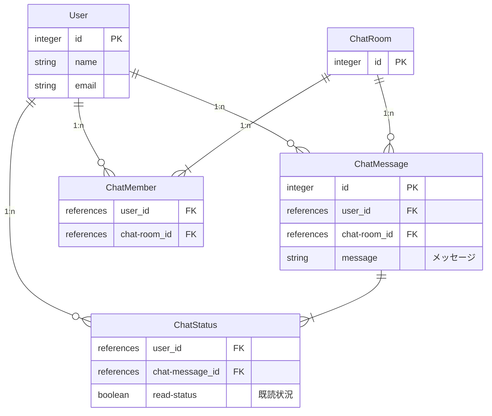

# Chat アプリ作成
PHP の Framework で Laravel を使用して Chat アプリを作成していきます。

## ERD図
- User ユーザー
- ChatRoom 部屋
- ChatMember メンバー
- ChatMessage メッセージ
- ChatStatus 未読管理



**Pusher** から送られてくるデータを `Channel` で テーブル **ChatRoom** の `id` を `ChatRoom.{id}` と言う形で設定して行きます。

## 制作物
### モデル、マイグレーション
`php artisan make:model モデル名 --migration --factor --seed` コマンドを実行してファイルを生成する

ChatRoom
```bash
php artisan make:model ChatRoom --migration --factor
```
ChatMember
```bash
php artisan make:model ChatMember --migration --factor
```
ChatMessage
```bash
php artisan make:model ChatMessage --migration --factor
```
ChatStatus
```bash
php artisan make:model ChatStatus --migration --factor
```

```bash
php artisan migrate
```

### コントローラー
`php artisan make:controller コントローラー名` コマンドを実行してファイルを生成する

ChatController
```bash
php artisan make:controller ChatController
```
### ビュー
`resources/views/chat` にChat用のフォルダを作成します。
```bash
mkdir resources/views/chat
```
`resources/views/chat/create.blade.php` 投稿ページ用にファイルを生成する
```bash
vim resources/views/chat/create.blade.php
```
```php

```

### イベント
ChatAdded

### ダミーデーター
